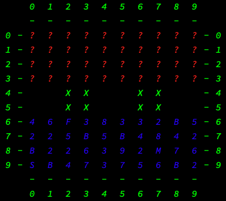
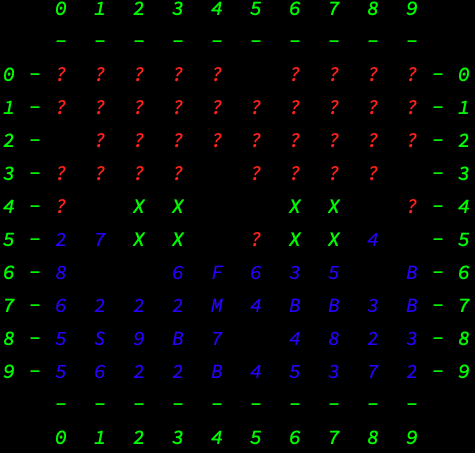
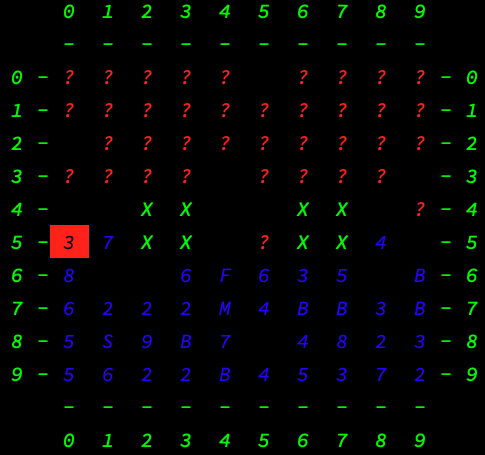

# Stratego

Stratego (/strəˈtiːɡoʊ/ strə-TEE-goh) is a strategy board game for two players on a board of 10×10 squares. Each player controls 40 pieces representing individual officer and soldier ranks in an army. The pieces have Napoleonic insignia. The objective of the game is to find and capture the opponent's Flag, or to capture so many enemy pieces that the opponent cannot make any further moves (Wikipedia, 2020).

## Pieces

| Rank   | Piece      | No. per player | Special properties                                                                                  |
| :----- | :--------- | :------------- | :-------------------------------------------------------------------------------------------------- |
| F (0)  | Flag       | 1              | Immovable; its capture ends the game                                                                |
| B (1)  | Bomb       | 6              | Immovable; defeats any attacking piece except Miner                                                 |
| 2      | Scout      | 8              | Can move any distance in a straight line, without leaping over pieces / lakes; can capture the Spy. |
| 3      | Miner      | 5              | Can defuse bombs; can capture all lower ranked pieces                                               |
| 4      | Sergeant   | 4              | Can capture all lower ranked pieces                                                                 |
| 5      | Lieutenant | 4              | Can capture all lower ranked pieces                                                                 |
| 6      | Captain    | 4              | Can capture all lower ranked pieces                                                                 |
| 7      | Major      | 3              | Can capture all lower ranked pieces                                                                 |
| 8      | Colonel    | 2              | Can capture all lower ranked pieces                                                                 |
| 9      | General    | 1              | Can capture all lower ranked pieces                                                                 |
| M (10) | Marshal    | 1              | Can capture all other pieces except the bomb, can be captured by the Spy if the Spy attacks first.  |
| S (11) | Spy        | 1              | Can defeat the Marshal, but only if the Spy makes the attack                                        |

## Setup

Typically, color is chosen by lot: one player uses red pieces, and the other uses blue pieces. Before the start of the game, players arrange their 40 pieces in a 4×10 configuration at either end of the board. The ranks are printed on one side only and placed so that the players cannot identify the opponent's pieces. Players may not place pieces in the lakes or the 12 squares in the center of the board. Such pre-play distinguishes the fundamental strategy of particular players, and influences the outcome of the game (Wikipedia, 2020).

## Rules

### Movement

All movable pieces, with the exception of the Scout, may move only one step to any adjacent space vertically or horizontally (but not diagonally). A piece may not move onto a space occupied by a like-color piece. Bomb and Flag pieces are not moveable. The Scout may move any number of spaces in a straight line (such as the rook in chess). In the older versions of Stratego the Scout could not move and strike in the same turn; in newer versions this was allowed. Even before that, sanctioned play usually amended the original Scout movement to allow moving and striking in the same turn because it facilitates gameplay. No piece can move back and forth between the same two spaces for more than three consecutive turns (two square rule), nor can a piece endlessly chase a piece it has no hope of capturing (more square rule) (Wikipedia, 2020).

### Attack

When the player wants to attack, they move their piece onto a square occupied by an opposing piece. Both players then reveal their piece's rank; the weaker piece (see exceptions below) is removed from the board. If the engaging pieces are of equal rank, both are removed. A piece may not move onto a square already occupied unless it attacks. Two pieces have special attack powers. One special piece is the Bomb which only Miners can defuse. It immediately eliminates any other piece striking it, without itself being destroyed. Each player also has one Spy, which succeeds only if it attacks the Marshal or the Flag. If the Spy attacks any other piece, or is attacked by any piece (including the Marshal), the Spy is defeated. The original rules contained a provision that following a strike, the winning piece immediately occupies the space vacated by the losing piece. This makes sense when the winning piece belongs to the player on move, but no sense when the winning piece belongs to the player not on move. The latter part of the rule has been quietly ignored in most play (Wikipedia, 2020).

#### Pre-Attack

#### Post-Attack

## Strategy

Chess has often been described as war in miniature, but it lacks at least one major characteristic
of real wars, namely, partial observability. In the “fog of war,” the existence and
disposition of enemy units is often unknown until revealed by direct contact. As a result,
warfare includes the use of scouts and spies to gather information and the use of concealment
and bluff to confuse the enemy. Partially observable games share these characteristics and
are thus qualitatively different from the games (Russell & Norvig, 2010).

## References

Russell, S. & Norvig P., (2010) Artificial Intelligence: A Modern Approach. Third Edition

Wikipedia (2020), Stratego, retrieved from: https://en.wikipedia.org/wiki/Stratego
